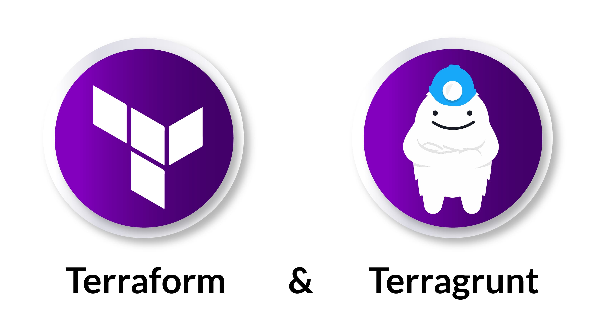
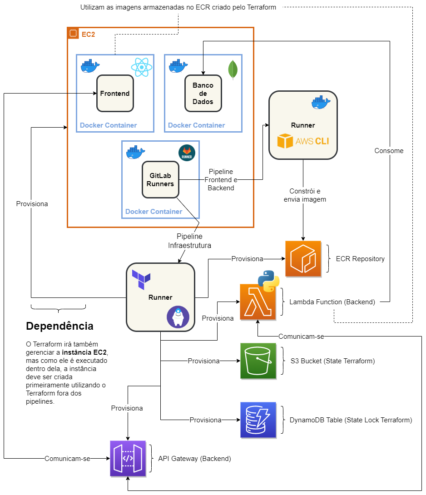
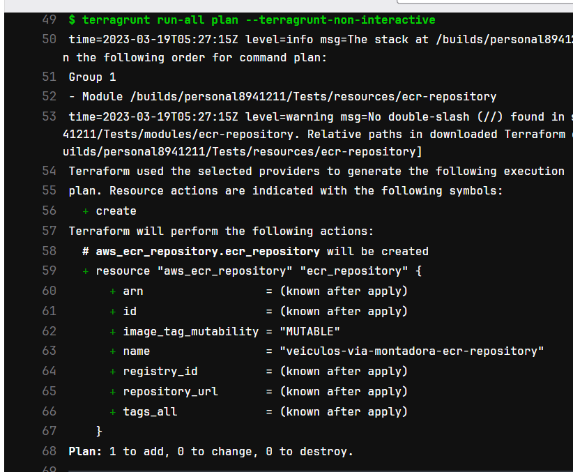
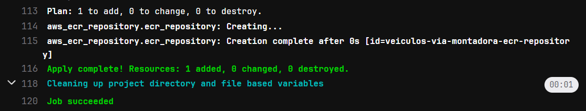

# Infraestrutura

Esse é o repositório de infraestrutura do projeto Veículos Via Montadora. Ele é responsável por gerenciar a infraestrutura do projeto, ou seja, provisionar os recursos necessários para que o projeto possa ser executado.

## Terraform

O projeto utiliza o [Terraform](https://www.terraform.io/) para provisionar recursos na AWS. O Terraform é um software de provisionamento de infraestrutura como código, que permite que você crie, altere e versione a infraestrutura de forma segura e eficiente. O Terraform pode gerenciar provedores de serviços como AWS, Google Cloud, Azure, etc.

## Terragrunt

Além do Terraform, o projeto também faz uso da ferramenta [Terragrunt](https://terragrunt.gruntwork.io/), que é uma ferramenta de linha de comando para o Terraform que fornece vários níveis de abstração com o objetivo de manter os arquivos de configuração do Terraform DRY (Don't Repeat Yourself). O Terragrunt pode provisionar recursos de vários módulos Terraform, permitindo que você crie uma hierarquia de módulos Terraform e reutilize o código. Além disso, ele gerencia automaticamente o estado do Terraform de forma remota, permitindo que várias pessoas trabalhem no mesmo projeto.

## Funcionamento

Nesse repositório nós temos arquivos Terraform que descrevem de forma **declarativa** os recursos que queremos provisionar na AWS. Isso significa que nós não precisamos nos preocupar com a lógica de provisionamento dos recursos, nós apenas descrevemos o que queremos provisionar.

### Módulos Terraform

Os arquivos Terraform são divididos em módulos, que são responsáveis por provisionar um tipo específico de recurso. Por exemplo, o módulo `ecr-repository` é responsável por provisionar um repositório ECR na AWS. Um módulo Terraform é um diretório que contém arquivos Terraform, `main.tf`, `variables.tf`, `outputs.tf`, etc. O **Terragrunt** é responsável por gerenciar os módulos Terraform, ele é responsável por executar o Terraform para provisionar os recursos na AWS.

### Gerenciamento de Estado

O Terraform guarda o estado dos recursos que estão sendo gerenciados por ele, esse estado é armazenado em um bucket S3 na AWS. O Terraform utiliza esse estado para saber quais recursos devem ser criados, alterados ou removidos. No momento em que os pipelines desse repositório são executados, o Terraform irá ler o estado atual dos recursos e comparar com o estado desejado, assim ele irá realizar as alterações necessárias para que o estado atual seja igual ao estado desejado. Se um arquivo desse repositório tiver sido alterado ou até mesmo deletado, o Terraform irá realizar as alterações necessárias para que o estado atual seja igual ao estado desejado.

### Terraform x Terragrunt, Qual a Diferença?

A extensão `.tf` é utilizada para arquivos Terraform, enquanto a extensão `.hcl` é utilizada para arquivos Terragrunt. De uma maneira bem resumida, podemos pensar que o Terraform é responsável por provisionar os recursos na AWS, enquanto o Terragrunt é responsável por gerenciar os módulos Terraform. Nos arquivos `.tf` teremos de fato a descrição dos recursos que queremos provisionar na AWS, enquanto nos arquivos `.hcl` estaremos 'chamando' os módulos Terraform e passando os parâmetros necessários para que os recursos sejam provisionados corretamente.

## O que é Provisionado?

Esse repositório é responsável por provisionar toda a infraestrutura cloud que pode ser visualizada no diagrama abaixo, Note o quadrado "**Runner**" com o logo do Terraform e do Terragrunt, todas as flechas "Provisiona" que saem dele são responsabilidade desse repositório.

## Fluxo de Pipelines

Esse repositório possui pipelines que são responsáveis por provisionar os recursos na AWS. O fluxo de pipelines é o seguinte:

### Merge Request Aberto de `branch_customizada` ➜ `develop`

Ao abrir um Merge Request de uma branch customizada para a branch `develop`, um pipeline será executado para realizar o plano de provisionamento dos recursos na AWS. Esse pipeline é responsável por validar se o código está correto e se os recursos serão provisionados corretamente. Caso o pipeline seja executado com sucesso, o Merge Request pode ser realizado e o código será mesclado com a branch `develop`.

Acima está um exemplo de um trecho do pipeline de planejamento de recursos na AWS, veja que o Terraform está nos dizendo que um repositório ECR será criado, o que é bem intuitivo através dos símbolos de `+` e da cor **verde**. Quando um recurso é removido, o Terraform nos informa com o símbolo de `-` e a cor **vermelha**.

### Merge Request Aberto de `develop` ➜ `master`

Esse é o mesmo fluxo do Merge Request acima, o planejamento dos recursos na AWS é realizado para garantir que o código está correto e que os recursos serão provisionados corretamente quando o Merge Request for realizado.

### Merge Request Realizado de `develop` ➜ `master`

Ao realizar o Merge Request de `develop` ➜ `master`, um pipeline será executado para realizar de fato o provisionamento dos recursos na AWS.

Acima está um exemplo de um trecho do pipeline de provisionamento de recursos na AWS, veja que o Terraform está nos dizendo que 1 recurso foi criado com sucesso.
